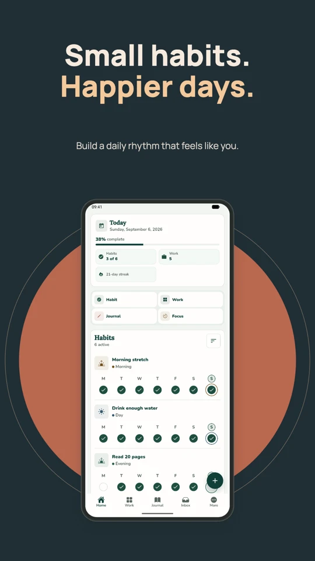
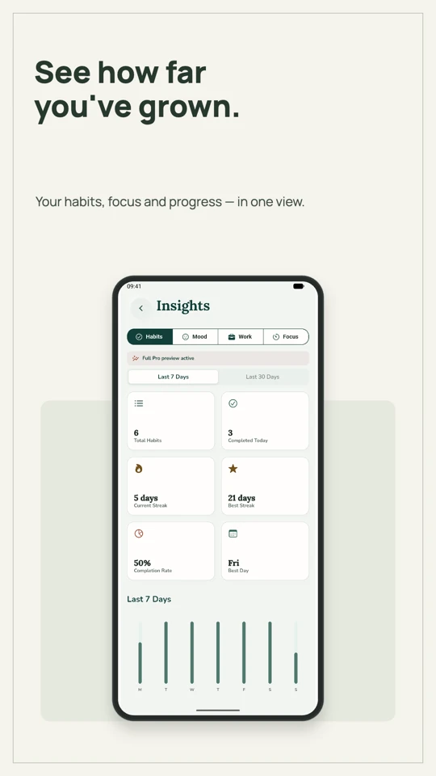
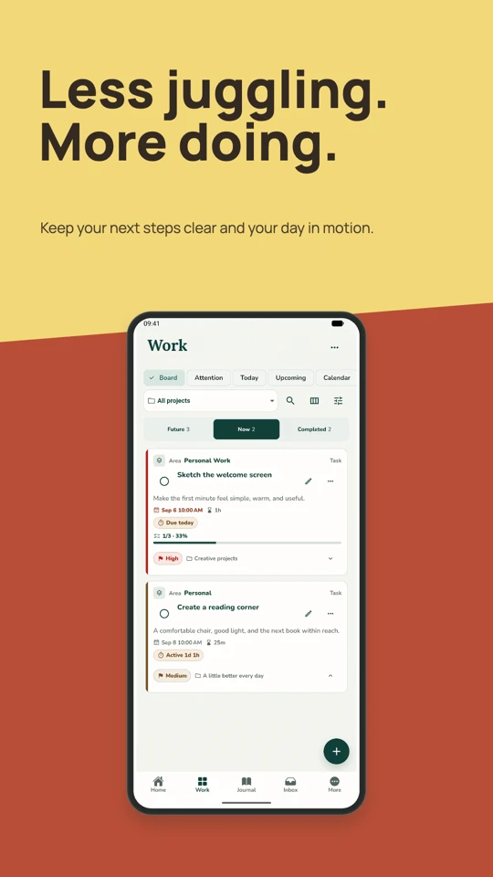
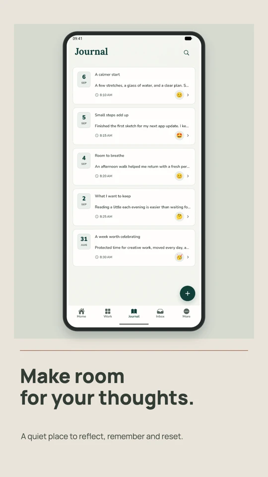
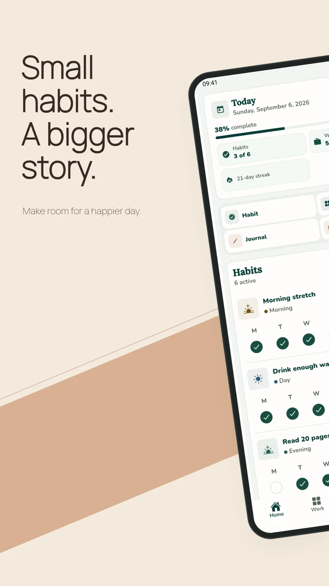
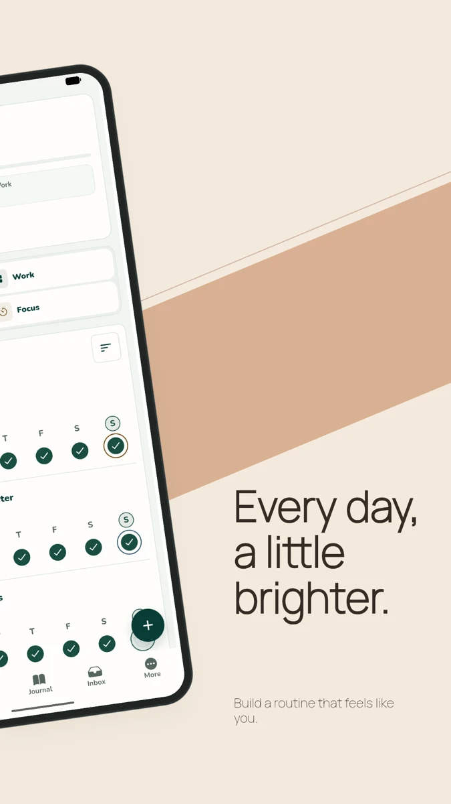

# Hen Screenshots

**Your app. Beautifully presented.**

Turn raw screenshots into polished App Store images, Google Play listings, and portfolio mockups. Pick a template, make it yours, and export straight from your browser.

**Free forever. No account. No watermarks.** Every template, device frame, and full-resolution export is included.

[**Open the studio →**](https://screenshots.hensell.dev/studio/) · [Explore the website](https://screenshots.hensell.dev/) · [Roadmap](ROADMAP.md) · [Share feedback](mailto:hensell@hensell.dev?subject=Hen%20Screenshots%20feedback) · [Support on Ko-fi](https://ko-fi.com/hensell)

<p align="center">
  
  
  
  
</p>

<p align="center"><em>Real exports made in Hen Screenshots, featuring FrogHappy.</em></p>

## Make something worth showing

- **Your own reusable templates.** Add background images, keep editable text and logos, and save a slide or panorama in **My templates**. Reuse it with new screenshots or share a portable `.hentemplate` file. [See how it works](#your-own-reusable-templates).
- **A template for your story.** 57 designs, from quiet editorial layouts to bold posters, including eleven panoramas that connect two slides into one scene.
- **Find your look quickly.** Search by name, color, pattern, device position, or visual idea. Filter by style, appearance (Light, Dark, or Colorful), composition, and background, sort results, and browse 12, 24, or 48 templates per page. Previews use your own screenshots.
- **Keep your favorites close.** Star any template and open **Favorites** to find it again. Favorites work with search, filters, and pagination and are shared across your projects in this browser. They stay on this device, outside project backups; no account is required.
- **Choose the right frame.** iPhone, Android phone, iPad, Android tablet, monitor, laptop, or a simple screenshot card.
- **Make the composition yours.** Customize captions, colors, typography, and backgrounds. Drag devices and text independently. Resize devices from their corner handles, with proportions preserved, or use the **Device size** slider. Rotate a device through 360° using its round canvas handle or the **Device rotation** slider. **Reset rotation** restores the template’s angle without changing size or position. Panorama halves rotate together; devices in a composition rotate independently.
- **Line things up.** Smart guides snap devices and text to centers, edges, margins, and nearby objects, including across panoramas. Hold Alt/Option to move freely, or turn guides off.
- **Preview before publishing.** Review store screenshots in a swipeable carousel or portfolio cards in a website grid. Check compact, phone, and wide reading sizes, then jump back to any slide to edit it.
- **One brand, every project.** Save an app’s palette, fonts for headlines and supporting text, and identifying logo in a reusable brand kit. Preview it on your screenshots and apply it to a slide, linked panorama, or entire series.
- **One design, multiple languages.** Edit independent captions, keep layouts linked, and export a folder per language. Translate manually or download optional local translation packs.
- **Edit a whole series.** Apply a template to one slide or the series. Replace an image while keeping its design, duplicate and reorder slides, and undo or redo changes.
- **Export for the destination.** Separate **App stores** and **Portfolio** workspaces keep store presets apart from cards, square formats, widescreen covers, and custom dimensions.
- **Keep your work.** Projects save automatically in your browser. Download an editable project file with its original images for backup or transfer.
- **Use your language.** The website and editor are available in English, Spanish, and Brazilian Portuguese. The language selector remembers your choice in this browser; it does not change your screenshot text or project language versions.

**Multi-device collection:** Sidekick, Handoff, Companion, Duet, Workspace, Desktop Suite, Ecosystem, and Constellation combine a phone with a desktop, a phone with a tablet, a tablet with a desktop, or all three. Find them under **Templates → Composition → Multiple devices**. Select each device on the canvas or in **Device** to replace its image, change its frame, move it, or resize it independently. **Reset placement** restores only the selected device. New devices initially reuse the current capture; replace each one with the right screenshot. Language versions can override each screen independently, and project files include every image.

**Christmas & New Year collection:** Evergreen, Snowfall, Gift Wrap, and Gingerbread bring pine branches, ornaments, paper snowflakes, ribbons, and iced cookies to holiday launches. Midnight, Firework, Countdown, and First Light welcome the new year with art deco details, fireworks, streamers, and a quiet sunrise. Search **Christmas** or **New Year** (also **Navidad / Año Nuevo** in Spanish and **Natal / Ano Novo** in Portuguese). All eight designs adapt to phone, tablet, desktop, and portfolio formats, with editable colors and no fixed year.

**Halloween collection:** Jack O’ Lantern, Cobweb, Boo, Witching Hour, Candy Club, and the two-slide Moonlight panorama bring carved pumpkins, fine webs, friendly ghosts, stars, candy, and a moonlit sky to your screenshots. Search **Halloween** or **October** in Templates; Spanish and Portuguese searches work too. All colors are editable, and the collection remains available year-round.

The patterns collection adds **Zest, Cabana, Contour, Cherry, Terracotta, Blueprint, Stitch, and Parade**: citrus stripes, aqua awnings, topographic curves, cherry checks, clay fans, cobalt grids, lilac zigzags, and burgundy scallops. Devices sit high, low, to either side, or on a diagonal, with separate space for captions. Search **stripes**, **checker**, **left**, or **diagonal** to find a composition. Open **Open templates → Appearance → Dark** to browse the dark templates. Every design remains editable and adapts to the project's frame and canvas.

### Two slides. One bigger story.

<p align="center">
  
  
</p>

Design the pair together, keep a different caption on each slide, and export two separate PNGs in a ZIP. **Panorama**, **Daybreak**, **Tidal**, **Orbit**, and **Moonlight** are joined by **Atrium**, **Obsidian**, **Offset**, **Signal**, **Mosaic**, and **Folio**. Browse them under **Open templates → Composition → 2-slide panorama**.

**Atrium, Obsidian, and Offset** add isometric devices, dimensional pedestals, and architectural shadows. The screenshot, frame, and camera share the projection, so your own image takes on the same depth. Search **3D** or **perspective** to find them. These are fixed isometric poses; you can still move, resize, and rotate the device on the canvas. **Signal, Mosaic, and Folio** use coral bands, rose tiles, and layered paper with different caption and device positions. All six adapt to phone, tablet, and portfolio canvases, preserve linked edits, and export through the same PNG renderer as the editor.

## Local agent plugin

A local plugin for Codex and Claude Code can turn a folder of captures into a styled series, render a preview, and export PNGs by language plus an editable Hen project. It reuses the web editor’s templates and scene engine, with native rendering through Konva and Skia. Requires Node.js 22.12+ and a one-time dependency installation.

See [plugin setup and commands](plugins/hen-screenshots/README.md) and the [design spec](plugins/hen-screenshots/skills/create-screenshots/references/design-spec.md). Build it with `npm run plugin:build`; create a local ZIP with `npm run plugin:pack`. Version 0.2.1 is available from the [GitHub Release](https://github.com/Hensell/hen-screenshots/releases/tag/plugin-v0.2.1), this repository, the website, and the [OpenAI Plugins Directory](https://chatgpt.com/plugins/plugins_6aa32bb05be881918e9fa402a5a1cde6), including support for projects with background images (schema 11). Anthropic review is pending; Codex and Claude Code can also install from the repository marketplace.

The [AI agents guide](https://screenshots.hensell.dev/agents/) includes a built ZIP download, one-time setup, copyable Codex and Claude Code examples, and the workflow for opening generated projects in the studio. It is also available in [Spanish](https://screenshots.hensell.dev/es/agents/) and [Brazilian Portuguese](https://screenshots.hensell.dev/pt-br/agents/). Website builds package the current plugin version automatically; `npm run plugin:pack -- --web` prepares the download for local development.

## From capture to export

1. [Open the studio](https://screenshots.hensell.dev/studio/), create an **App stores** or **Portfolio** project, then choose **Add slide** to start with a blank canvas. Use **Add image** when your screenshot is ready; adding it preserves your text and layout. You can also import multiple screenshots at once from the empty project.
2. Choose a template and frame. Use **Design**, **Text**, **Device**, and **Canvas** to adjust the result. Drag text or devices on the canvas; their reset controls return them to the template position.
3. Click **Export** to download a PNG, a panorama pair, or the whole series as a ZIP. Use **Download project** (**Project file** on small screens) to keep an editable backup too.

**Keyboard:** focus the preview and press **Enter** to select an object. Move it with the arrow keys, or resize the selected device with **+ / −**; hold **Shift** for larger steps. Outside text fields, **⌘/Ctrl + Z** undoes changes and **⌘/Ctrl + Shift + Z** redoes them.

**Before exporting:** open **Preview** beside Export to check small-screen readability and the spacing between panorama slides. Use the carousel's arrow keys, Home/End, or swipe. This is a reading-size simulation; store layouts vary. Guides and preview controls never appear in exported images.

## One design, every language

The **Website language** selector changes the interface, including the landing page, project library, editor, and dialogs. It starts with your browser's preferred supported language and remembers an explicit choice. This is separate from the **Languages** dialog inside a project, which manages the text you export in your screenshots.

Open **Manage** beside the text language selector in the studio toolbar, choose the language of your original captions, and add a language version. The original text and translation appear side by side. Everything saves automatically. The toolbar’s language selector changes the canvas, thumbnails, inspector, and publication preview together.

- Colors, templates, frames, device positions, and slide order stay shared.
- Captions are independent. Each language can override text positions, headline size, and screenshot images; reset controls restore the shared settings.
- Original text changes flag existing translations for review without overwriting your edits. Newly added slides start as untranslated.
- **Export** lets you select languages. ZIPs contain folders such as `en/` and `es/`, with numbered PNGs or JPEGs at the project’s export resolution. Project files include all language versions and their images.

**Manual editing always works without a model download.** Optional **Translate on device** uses OPUS-MT through Transformers.js in a dedicated WebAssembly worker; it does not use Chrome’s Translator API or a hosted inference service. Downloadable packs currently cover English, Spanish, French, and German. Pairs without English use two packs and translate through English. Other listed languages support manual editing.

The download dialog explains the size before starting: roughly **112–120 MB per directional language pack**, plus shared runtime files on first use. Files download from Hugging Face and jsDelivr; captions stay on the device. Packs are cached when browser storage permits, can be removed from the dialog, and are not included in project backups. Cache eviction or clearing site data can require another download. Performance depends on browser and hardware; downloads, cancellation, and errors preserve your text. Review machine translations before publishing, especially marketing headlines.

Translations support up to **10 languages per project**. The initial language list uses scripts covered by the bundled fonts; RTL and CJK typesetting are not yet offered. Image ZIP exports are limited to 250 MB before packaging; split larger exports into smaller batches.

## Image checks and local compression

Uploads are checked by their actual file signature, dimensions, and browser decoding, including files with misleading extensions. Captures and slide artwork accept **PNG, JPEG, still WebP, plus HEIC/HEIF, AVIF, and SVG through local PNG conversion**, up to **50 MB and 24 megapixels per imported image** and **120 MB of referenced source images per project**. Brand-kit logo inputs have a **5 MB** limit.

When files need attention, the import dialog names each problem and shows file size, resolution, and remaining capacity. Uncheck files to omit them, or choose **Compress to fit** to prepare optimized copies on your device, then explicitly import the result. Compression can reduce quality and resolution; original files remain unchanged, JPEG orientation and PNG/WebP transparency are preserved. Replacements count only assets still referenced elsewhere, including other language versions.

Local compression accepts inputs up to **80 MB, 64 megapixels, and 32,768 pixels per side**. Larger sources must be reduced externally. Damaged files, unsupported encodings, TIFF, BMP, PDF, JPEG XL, Photoshop documents, GIF, and animated PNG/WebP/AVIF receive actionable guidance; changing an extension does not convert the file. A file that the browser cannot decode may still fail optimization and need to be saved again as JPEG or PNG.

### AVIF and SVG artwork

Choose **Convert to PNG** in the review dialog, inspect the copy, and import it explicitly. Conversion preserves transparency and keeps processing on your device. AVIF decoding uses the browser; unsupported variants receive instructions to export a PNG or JPEG elsewhere. Sources are limited to 80 MB and 24 megapixels. SVG conversion accepts self-contained files up to 5 MB with explicit pixel dimensions or a valid viewBox. Scripts, external resources, embedded images, stylesheets, filters, and animations are rejected with guidance to export a flattened PNG. Fonts must be available on the device; convert text to paths in your design tool for exact typography.

### iPhone HEIC and HDR screenshots

HEIC/HEIF files open the image review dialog. Choose **Convert to PNG** to download the converter from this site and process the main image locally. No image is uploaded to a server. Review the resulting preview, then import it. The copy keeps its pixel dimensions; if it exceeds the file or project budget, choose compression separately. Cancel stops the worker and leaves the project unchanged.

For HDR captures with an SDR base and a gain map, conversion uses the SDR base and preserves its ICC color profile; the extra HDR brightness is not included. Unsupported standalone HDR/wide-color encodings receive guidance to export an SDR PNG or JPEG. HEIC conversion accepts source files up to **80 MB**, but the decoded main image must fit **24 megapixels and 32,768 pixels per side**; larger HEICs must be resized externally. Normal imports remain limited to **50 MB per image**, **120 MB per project**, and **5 MB per brand-kit logo input**. Your original files stay untouched.

The decoder runs in a disposable worker, is fetched only after conversion is requested, and is subject to browser memory limits and a one-minute timeout. Its LGPL license, exact version, and corresponding source/build links are included in [the decoder notices](public/vendor/heif/README.md).

## Logos, awards, and extra artwork

Open **Design → Extra images → Add image or icon** to place PNG, JPEG, still WebP, or locally converted HEIC, AVIF, or SVG artwork over a slide. Add up to **8 images per slide**, including transparent logos and award badges. Each image has its own position, size, and rotation. Drag it on the canvas, resize from a corner, or use the inspector; **Reset placement** restores its starting size and position. **Bring forward** and **Send backward** control the order of extra images above the screenshot and captions.

Replacing or removing extra artwork leaves the app screenshot intact. Removal asks for confirmation, and undo/redo covers these edits. Template changes preserve your extra images. They are included in thumbnails, publication previews, PNG exports, and project backups, and shared across language versions. In panoramas, each image belongs to one slide and can cross the seam into the next. This works in App stores, Portfolio, and Banners projects.

## Google Play banners

Choose **New project → Banners** to create store artwork in a separate workspace. Start by uploading an image or app icon (PNG, JPEG, or still WebP), then choose one of six banner templates: **Signal, Brand Orbit, Wordmark, Coral Ribbon, Dusk, and Paper Parade**.

| Format            | Export size       | Used for                              |
| ----------------- | ----------------- | ------------------------------------- |
| Feature graphic   | **1024 × 500 px** | Required for your Google Play listing |
| Android TV banner | **1280 × 720 px** | Required for Android TV apps          |

Use **Canvas → Banner format** to switch between these fixed sizes. Drag the image or text, resize the image, and use the reset controls to return to the template's placement. Transparent source images retain their shape against the artwork; every exported banner is an **opaque 24-bit RGB PNG**. Brand kits, language versions, local saving, and project backups work here too.

You can keep several alternatives in one project. Select and export the design you want; Google Play uses one banner per format and language. Selecting multiple languages creates a ZIP with a folder per language. Keep essential text and artwork away from the edges, which Google Play may crop or overlay. A feature graphic should communicate your app's experience; avoid simply enlarging its icon.

Dimensions and file requirements checked on **September 8, 2026** against [Google Play's official preview asset requirements](https://support.google.com/googleplay/android-developer/answer/9866151?hl=en).

## Your own reusable templates

Add artwork in **Design → Background image**, then choose whether it fills the canvas or fits inside it. Adjust opacity over the template’s colors and decorations. In a panorama, the background spans both slides continuously. Captions, device frames, and extra images stay independently editable.

Choose **Design → Save as template** to keep a slide or a complete panorama in **My templates**. A saved template includes the current language’s text, typography, layout, background, and extra images (such as logos). Device captures are replaced with empty slots; other language versions and brand-kit metadata are omitted. Text already embedded in an uploaded image stays part of that image.

Open **My templates** from the project library, the template gallery, or the Design tab. Search your saved designs and preview one before using it. **Add to this project** appends new slides when the workspace, proportions, and slide limit are compatible. **Open as new project** keeps the template’s original canvas. Each use is an independent copy, so changing or deleting a saved template never changes existing projects.

Use **Export template** to download a `.hentemplate` file, and **Import template** to bring it into another browser or share it with someone else. Background and extra-image files are included: review that artwork before sharing. Templates are stored locally in IndexedDB and are not published to a public gallery. Clearing site data removes the local library, so keep exported copies. Project backups include the artwork used by that project, not the whole template library.

## Your screenshots stay with you

**Brand kits** are available from the project library and **Design → Brand kit**. Start with **New kit**, capture your existing design with **From slide**, or import a `.henbrand` file. Choose Manrope or Fraunces for each text role, save the kit, and choose where to apply it. Your captions, device positions, templates, and export dimensions stay intact. The kit’s logo identifies the app in your library; it is not automatically placed on screenshots.

Projects keep independent copies of applied kits. Editing or deleting a library kit does not change earlier work. Export a kit to move it between browsers; project backups also include their applied brands and logos. **Recover project’s brand** saves an embedded copy back into your library.

Image processing, preview rendering, project storage, and exports happen in your browser. There is no account, screenshot upload service, or cloud synchronization. Fonts are bundled locally.

Projects belong to the browser and site where you created them. Clearing site data removes those local projects. To move to another browser, computer, or domain, choose **Download project** (`.henscreenshots`), then **Open project file** in the other studio. Importing a backup creates a new copy.

| Item                            | Current limit                                                |
| ------------------------------- | ------------------------------------------------------------ |
| Slides per project              | 20                                                           |
| Source image                    | 50 MB and 24 megapixels                                      |
| Source images used by a project | 120 MB combined                                              |
| Custom portfolio canvas         | 256–4096 px per side, up to a 4:1 aspect ratio               |
| Store series export             | 8 images for a Google Play device slot; 10 for an Apple slot |

Exports are opaque RGB images at the selected dimensions: **24-bit PNG** for crisp UI text, or **JPEG** for smaller files. Open **Export** to review dimensions, format, and store guidance. Generate the files, inspect their individual sizes and preview, then choose **Save**. **Prepare smaller JPEGs** keeps the same resolution while reducing quality; source images remain unchanged. ZIP exports retain separate language folders.

The suggested 8 MB per image is a Hen Screenshots recommendation, not a universal store limit. Android XR has a published 8 MB cap: oversized files cannot be saved from its export dialog until reduced. Count guidance describes the complete listing; individual exports remain available while assembling a set. Content and store approval cannot be certified by pixel checks.

Store presets include iPhone, iPad, Mac, Apple Watch, Apple TV (HD/4K), Apple Vision Pro, Google Play phones/tablets/Chromebooks, Wear OS, Android TV, Automotive, and Android XR. Wear OS displays and exports only the square, opaque source capture, with no added device frame, captions, or overlays. Its saved design is available again when switching destinations. See the [export profiles](src/core/export-profiles.ts) and [verification notes](docs/export-validation-2026-09-09.md).

## Run locally

Requires **Node.js 22.12+**. The project pins Node **22.21.1** in [`.node-version`](.node-version).

```sh
git clone https://github.com/Hensell/hen-screenshots.git
cd hen-screenshots
npm ci
npm run dev
```

Open [localhost:5174](http://127.0.0.1:5174/) for the landing page or [localhost:5174/studio/](http://127.0.0.1:5174/studio/) for the editor.

| Command                 | What it does                                                        |
| ----------------------- | ------------------------------------------------------------------- |
| `npm run dev`           | Start the local Vite server on port 5174                            |
| `npm test`              | Run the Vitest suite                                                |
| `npm run lint`          | Check TypeScript/React code with Oxlint                             |
| `npm run format:check`  | Verify source and configuration formatting                          |
| `npm run format`        | Format source and configuration files                               |
| `npm run check`         | Run lint, format checks, tests, type checks, and production build   |
| `npm run build`         | Type-check and build production assets                              |
| `npm run preview`       | Serve the build locally; stop the dev server first                  |
| `npm run deploy:check`  | Build and validate a Cloudflare deployment without publishing       |
| `npm run deploy`        | Build and publish using an authenticated Wrangler session           |
| `npm run social:images` | Regenerate the three social sharing images and PNG brand icons      |
| `npm run seo:check`     | Check deployed HTML, social images, indexing directives, and routes |

## How it is built

**React · TypeScript · Vite · Konva · Zustand · Dexie / IndexedDB · Cloudflare**

The landing page uses static HTML and CSS, with a small script for interface language selection. The React editor loads at `/studio/`. A shared Konva scene renders editor previews, template thumbnails, and full-resolution exports, so they use the same composition rules.

English, Spanish, and Portuguese landing pages have their own static URLs, localized sharing images, canonical and language links, and structured data. See [search and sharing](docs/seo.md) for generation commands, verification, and indexing behavior.

The library loads first. Canvas rendering, templates, brand kits, publication preview, languages, backups, and export tools load when needed. Optional dialogs show loading and recovery states so a failed download does not close the active project.

| Directory          | Responsibility                                                                  |
| ------------------ | ------------------------------------------------------------------------------- |
| `src/app/`         | Editor shell, project-library navigation, dialogs, and loading recovery         |
| `src/core/`        | Project schema, templates, catalog search, and export profiles                  |
| `src/editor/`      | Editing state, undo/redo, inspector, and template library                       |
| `src/rendering/`   | Shared scene, device frames, typography, and decorations                        |
| `src/assets/`      | Image validation and decoding                                                   |
| `src/storage/`     | IndexedDB persistence, migrations, and project backups                          |
| `src/export/`      | PNG rendering, snapshot-based language exports, ZIP packaging, and cancellation |
| `src/translation/` | Pinned model catalog, optional worker, download cache, and cancellation         |

The catalog is indexed locally. Only the current page's cards are mounted, and canvas previews render near the visible area. Search and pagination are tested with 10,000 synthetic entries; the actual catalog currently contains 57 templates.

Autosave checks revisions to prevent one tab from overwriting another tab's changes. Image blobs are immutable: caption edits only write the document, and unused images are removed from the saved copy. Undo/redo retains the required original images in the current editing session. Brand kit updates use revision checks too. Project files use schema 11 and support migration from versions 1–10. Tests cover image and archive validation, persistence conflicts, migrations, undo/redo, template behavior, text placement, geometry, brand snapshots, portability, localization, translation cancellation, and export profiles.

Exports capture one revision of the project and its source images before rendering. Language folders, slide numbering, missing-image errors, cancellation, and packaging limits have dedicated regression tests. The [workflow QA report](docs/workflow-qa-2026-09-08.md) distinguishes automated coverage, visual checks, and validation limits.

### Deployment

The public app runs on **Cloudflare Workers Static Assets**. **Workers Builds** is connected to this repository: each push to `main` runs `npm run check`, then deploys with `npx wrangler deploy` if the checks pass.

See [deployment instructions](docs/deployment.md) for build settings, custom domains, manual deployment, and rollback. There is no application backend or database service to provision.

## Feedback and contributing

Built by [Hensell](https://hensell.dev) for his own apps, and for the things you are building too.

See the [public roadmap](ROADMAP.md) for the next priorities: first-use improvements, collections shaped by real apps, and agent plugin distribution. It records direction and readiness without promising release dates. The [plugin distribution notes](docs/plugin-distribution.md) track released versions, verification, and directory updates.

If Hen Screenshots helps you showcase your apps, you can [support its development on Ko-fi](https://ko-fi.com/hensell). Donations are optional; the editor remains free forever.

Enjoying it? Found a bug? Have a template in mind? [Open an issue](https://github.com/Hensell/hen-screenshots/issues) or email [hensell@hensell.dev](mailto:hensell@hensell.dev?subject=Hen%20Screenshots%20feedback). For bugs, include your browser, the steps to reproduce, and what you expected. Only attach screenshots or project files you are comfortable sharing publicly.

For code contributions, keep changes focused and run `npm run check`. Check rendering changes in both the preview and a PNG export, and check UI changes on mobile. New templates need a catalog entry and search keywords in [`src/core/templates.ts`](src/core/templates.ts), with any new scene behavior in `src/rendering/`.

**License:** the application and local plugin code use the [MIT license](LICENSE). The hosted editor is free to use forever. Bundled fonts retain their [Manrope](brand/fonts/OFL.txt) and [Fraunces](brand/fonts/OFL-Fraunces.txt) licenses.

## Project notes

- [Patterns and positions collection](docs/pattern-collection-2026-09-08.md)
- [Light and dark template collection](docs/template-collection-2026-09-08.md)
- [Workflow QA and loading improvements](docs/workflow-qa-2026-09-08.md)
- [Technical review and follow-up priorities](docs/technical-review-2026-09-08.md)
- [Architecture and original implementation plan](docs/architecture.md)
- [Brand identity](docs/brand-identity.md)
- [Device frame design](docs/device-frames.md)
- [Store export presets](docs/devices-and-exports-v0.3.md)
- [Portfolio formats](docs/portfolio-v0.4.md)
- [Panoramas and workspace separation](docs/panorama-and-workspaces-v0.6.md)

These notes record design decisions and earlier milestones; the sections above describe the current app.

Translation model credits: [Helsinki-NLP / OPUS-MT](https://github.com/Helsinki-NLP/OPUS-MT-train), [Xenova’s ONNX conversions](https://huggingface.co/Xenova), and [Transformers.js](https://github.com/huggingface/transformers.js). Model revisions are pinned in [`src/translation/catalog.ts`](src/translation/catalog.ts); their original model licenses apply. These third-party licenses are separate from the application’s MIT license.
