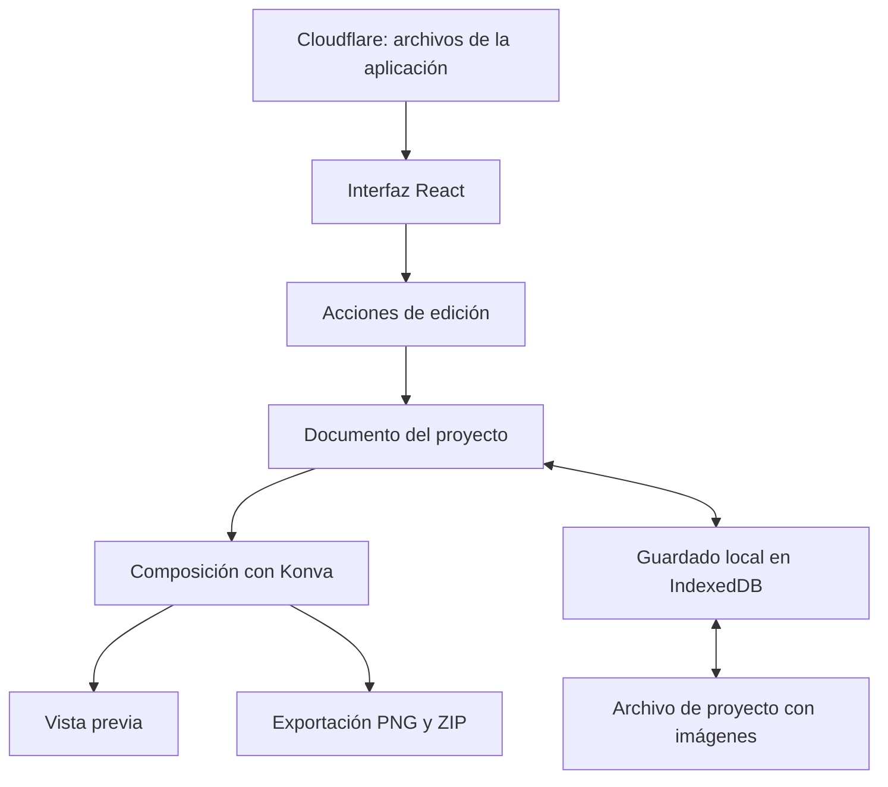

# Arquitectura propuesta de Hen Screenshots

Estado: arquitectura de referencia. Fecha: 6 de septiembre de 2026. El [alcance implementado en v0.1](editor-v0.1.md) documenta el primer editor y las partes pendientes de esta propuesta.

## Objetivo

Completar el flujo crear proyecto → importar capturas → diseñar una serie → guardar → reabrir → exportar. El primer usuario será su creador y el primer destino será Google Play. La aplicación se desplegará en Cloudflare.

La primera versión incluirá **dos familias de layouts y marcos: iOS y Android**, según la decisión del usuario. La familia del dispositivo será independiente del perfil de exportación. El detalle y los criterios de aceptación están en [Marcos y layouts de dispositivos](device-frames.md).

La interfaz, el documento editable, el renderizado y el almacenamiento tendrán límites claros dentro de una sola aplicación web. El trabajo del editor y las imágenes permanecerán en el navegador en esta primera versión.

## Estructura general



El documento del proyecto es la fuente de verdad. Konva representa ese documento en el lienzo. Guardaremos nuestros propios datos serializables: esto facilita reconstruir el diseño, implementar deshacer y evolucionar el formato. [Recomendación de Konva](https://konvajs.org/docs/data_and_serialization/Best_Practices.html).

## Tecnologías

| Responsabilidad        | Elección propuesta                    | Motivo                                                                                             |
| ---------------------- | ------------------------------------- | -------------------------------------------------------------------------------------------------- |
| Interfaz y compilación | React + TypeScript + Vite             | Base acordada, compatible con Cloudflare y un futuro frontend de Tauri                             |
| Estado del editor      | Zustand                               | Suscripciones por partes del estado; las acciones de edición se organizan fuera de los componentes |
| Lienzo                 | Konva en un componente React          | Escena compartida entre composición y exportación                                                  |
| Persistencia local     | IndexedDB mediante Dexie              | Proyectos, imágenes binarias y operaciones transaccionales                                         |
| Archivos ZIP           | fflate                                | Exportación de series y empaquetado de proyectos                                                   |
| Apariencia             | CSS con las variables de la identidad | Reutilizar la paleta, Manrope y el símbolo existentes                                              |
| Despliegue             | Cloudflare Workers con Static Assets  | Servir el frontend y permitir una API futura en Cloudflare                                         |

Las versiones están fijadas en `package.json` y `package-lock.json`. El primer editor usa una escena Konva común para vista previa y exportación, sin necesitar `react-konva`.

## Modelo del proyecto

| Entidad             | Contenido                                                                                                                     |
| ------------------- | ----------------------------------------------------------------------------------------------------------------------------- |
| Project             | ID, nombre, versión del esquema, revisión de guardado, fechas, estilo compartido, dispositivo predeterminado y serie ordenada |
| Artboard            | ID, nombre, perfil y dimensiones de exportación, fondo, elementos ordenados y personalizaciones del dispositivo               |
| Element             | ID, tipo, posición, tamaño, rotación, visibilidad y propiedades del contenido                                                 |
| Asset               | ID, tipo MIME, dimensiones originales, nombre de origen y archivo binario                                                     |
| Template            | ID y versión de una composición inicial, con presets iOS y Android; se materializa en datos editables al aplicarla            |
| DeviceFrame         | ID, versión, familia iOS o Android, geometría del marco y pantalla, recortes opcionales y áreas seguras                       |
| CapturePresentation | Referencia al asset, recorte no destructivo, ajuste proporcional y tratamiento de barras de sistema y recorte de cámara       |
| ExportProfile       | ID y versión, destino, dimensiones y reglas de archivo; independiente del dispositivo                                         |

Tipos iniciales de elemento: **texto**, **captura con marco opcional** y **forma simple**. Cada artboard corresponde a una pieza exportable de la serie.

Reglas:

- Las coordenadas se expresan en píxeles del documento. El zoom modifica la vista, sin alterar posiciones ni resolución de exportación.
- Las imágenes se referencian por ID. Los archivos originales se guardan como Blob en IndexedDB, fuera del JSON y del historial.
- Los identificadores de fuente y marco resuelven recursos versionados. Los diseños existentes deben conservar esos recursos al actualizar la app.
- La captura conserva su archivo original. Los recortes, la máscara de pantalla y el tratamiento de barras pertenecen a su presentación editable.
- Un proyecto guarda las propiedades materializadas de sus plantillas; un cambio futuro del catálogo no modifica proyectos anteriores.
- El primer tamaño de trabajo propuesto será 1080 × 1920. Los perfiles de exportación tendrán reglas propias y se verificarán contra los requisitos del destino.

## Estilo compartido y edición individual

El proyecto define colores, fuente y familia/marco predeterminados. Cada pieza hereda esas propiedades mientras no tenga una personalización propia. Una plantilla comparte sus espacios para título, descripción y captura entre las variantes iOS y Android; cada variante aporta la geometría y los espacios adecuados a su dispositivo.

Cambiar el estilo del proyecto actualiza los valores heredados y conserva las personalizaciones individuales. La opción “Reset to project style” elimina esas personalizaciones en la pieza seleccionada. Una acción explícita “Apply to all” permite extender el valor seleccionado a toda la serie y se puede deshacer como una sola operación.

El contenido de los textos, el orden de las piezas y las posiciones editadas no cambian al modificar solamente colores o tipografía.

Cambiar la familia del marco conserva el contenido y las dimensiones de exportación; ajusta la captura proporcionalmente al área de pantalla. Aplicar el layout de esa familia es otra acción explícita que puede cambiar la composición y se puede deshacer. No se deduce Google Play o App Store a partir del marco.

## Marcos, áreas seguras y barras de sistema

El catálogo inicial incluye un marco iOS y uno Android, ambos con opción de ocultar el marco. La variante iOS contempla un recorte superior opcional; la Android, una cámara perforada opcional. Son geometrías propias del editor, sin prometer reproducciones de modelos comerciales concretos.

Cada definición versionada distingue contorno externo, máscara de pantalla, zona del recorte superior e insets de contenido seguro. El compositor usa esas mismas medidas para la vista previa y el PNG. Ajustar una captura nunca estira sus proporciones; el modo inicial muestra el contenido completo y el recorte para llenar se aplica por elección del usuario.

Las capturas importadas conservan por defecto sus barras de estado y navegación originales. El editor no añade otra hora, batería, indicador inferior o cámara sobre elementos ya visibles. Para sustituir las barras se debe declarar el recorte de las originales o usar una captura sin ellas; después se pueden generar barras de la familia elegida con hora y batería fijas. Estos ajustes se guardan en el documento. El alcance preciso se detalla en [la especificación de dispositivos](device-frames.md).

## Estado y deshacer

Se distinguen tres categorías:

1. **Documento persistente:** contenido y diseño del proyecto.
2. **Sesión de edición:** selección, zoom, panel activo y movimiento en curso.
3. **Trabajos asíncronos:** importación, guardado y exportación, con progreso y errores.

Las modificaciones del documento pasan por acciones explícitas: cambiar texto, mover elemento, aplicar estilo, duplicar o reordenar pieza. El historial conserva estados del documento con referencias a los assets; una interacción de arrastre o una sesión de edición de texto se agrupa como un cambio. Zoom y selección no generan pasos de deshacer.

El historial inicial será acotado y vivirá durante la sesión. Los assets utilizados por el documento o por un estado recuperable del historial deben conservarse. Su limpieza se hace cuando dejan de estar referenciados. [Patrón de deshacer con React y Konva](https://konvajs.org/docs/react/Undo-Redo.html).

## Guardado y archivos de proyecto

- Autoguardado después de cambios confirmados, con una breve agrupación de escrituras.
- Proyectos e imágenes nuevos se guardan de forma consistente en una transacción. Las escrituras se ordenan para que un guardado antiguo no sustituya uno reciente.
- La interfaz muestra “Saving…”, “Saved on this device” o un error recuperable. El estado guardado solo se confirma cuando la transacción termina.
- Un fallo de almacenamiento conserva los cambios en memoria y ofrece reintentar o descargar el proyecto.
- Una revisión de documento permite detectar si otra pestaña modificó el mismo proyecto. Ante un conflicto, ofrecer recargar o guardar una copia; conservar el trabajo de la sesión.

Formato de respaldo propuesto: **`.henscreenshots`**, un ZIP que contiene `project.json`, `assets/` y los recursos adicionales necesarios para reconstruir el diseño. El manifiesto incluye `schemaVersion`. Las fuentes empaquetadas deben permitir su redistribución.

Al importar, validar estructura, versión, referencias, tipos de archivo y límites de tamaño antes de guardar. Una versión futura desconocida produce un mensaje claro. Importar crea una copia con IDs locales nuevos para preservar proyectos existentes. Las migraciones mantienen el archivo original recuperable.

IndexedDB depende del navegador y del origen. El archivo de proyecto permitirá trasladar trabajo entre localhost, el dominio definitivo y otros dispositivos. [Documentación de Dexie](https://dexie.org/docs/Tutorial/React).

## Vista previa y exportación

Una función común convierte el documento en una escena resuelta con textos, geometría, colores y recursos. La vista previa y la exportación consumen esa misma composición.

La exportación:

1. Captura una revisión inmutable del proyecto.
2. Espera a que todas las imágenes y fuentes requeridas estén disponibles.
3. Renderiza cada pieza en un lienzo de exportación a sus dimensiones reales, con el mismo código de composición.
4. Excluye selección, guías y controles del editor.
5. Comprueba el archivo generado: dimensiones, contenido, opacidad y codificación conforme al perfil de destino.
6. Descarga un PNG o añade las imágenes a un ZIP con nombres numerados según su orden.

La serie se procesa de forma secuencial para limitar memoria, con progreso y cancelación. Un fallo identifica la pieza afectada y permite reintentar; un paquete incompleto debe identificarse como tal.

La prueba inicial comprobará la codificación PNG real del navegador, además del aspecto visual. Si el codificador no cumple el perfil del destino, se incorporará la conversión necesaria en el módulo de exportación.

## Organización inicial del código

```text
src/
  app/             # Entrada, navegación y estilos de la aplicación
  projects/        # Lista, creación, apertura y duplicado de proyectos
  editor/          # Paneles, controles, selección y atajos
  core/            # Documento, validación, acciones, historial y reglas de estilo
  rendering/       # Composición compartida y componentes de Konva
  assets/          # Importación, resolución y ciclo de vida de imágenes y fuentes
  templates/       # Composiciones versionadas y presets iOS/Android
  devices/         # Marcos, máscaras, áreas seguras y barras iOS/Android
  storage/         # Repositorio de proyectos, Dexie y migraciones
  export/          # PNG, ZIP y archivos de proyecto
  platform/        # Abrir archivos, descargar y futuras integraciones de escritorio
```

El núcleo no depende de React, Konva ni Cloudflare. La capa de almacenamiento expone operaciones de proyecto y assets; la de plataforma expone las operaciones con archivos. Los componentes de edición acceden a esas funciones, de modo que una futura integración con Tauri tenga puntos de entrada definidos.

La primera versión será un repositorio y una aplicación. No requiere API de negocio, cuentas, base de datos remota ni subida de capturas. Una eventual sincronización añadirá identidad, almacenamiento remoto y resolución de conflictos como una fase independiente.

## Pantallas iniciales

- **Projects:** crear, abrir, duplicar e importar proyectos.
- **Editor:** serie de screenshots, lienzo, biblioteca y propiedades; exportación desde esta misma pantalla.

La edición completa se prioriza para escritorio. La distribución para pantallas estrechas se especificará antes de implementarla y conservará acciones explícitas para importar, seleccionar y exportar.

## Orden de implementación y validación

1. **Base ejecutable:** React + Vite + TypeScript, identidad y configuración de Cloudflare; compilación y vista previa local.
2. **Recorrido mínimo:** una pieza, importar una captura, editar texto y fondo, elegir marco iOS o Android, moverlo, guardar, reabrir y exportar PNG. Validar el ajuste proporcional y las barras de sistema antes de ampliar el catálogo.
3. **Serie:** varias piezas, estilo compartido, duplicación, orden y deshacer/rehacer.
4. **Trabajo recuperable:** descargar e importar proyectos completos y manejar fallos de guardado.
5. **Entrega para uso personal:** plantillas con variantes iOS y Android, exportación ZIP y revisión con capturas reales del usuario.

Pruebas prioritarias cuando exista la implementación: consistencia entre vista previa y PNG, dimensiones y codificación del archivo, recuperación del proyecto con imágenes, historial de edición, cambios de estilo con personalizaciones, importación inválida y guardados concurrentes. No hacen falta pruebas de interfaz que solo repitan la estructura del código.

El criterio del primer recorrido completo será que el usuario pueda diseñar una pieza de su app, cerrar y abrir el proyecto, y obtener la imagen esperada a la resolución elegida.

La entrega inicial requiere además exportar ambas familias sin barras ni recortes de cámara duplicados, recuperar su configuración al reabrir y cambiar de familia sin alterar el perfil de exportación ni perder contenido. Los [criterios de dispositivos](device-frames.md#criterios-de-aceptación) forman parte de esa validación.

## Referencias

- [React + Vite en Cloudflare](https://developers.cloudflare.com/workers/framework-guides/web-apps/react/)
- [Zustand](https://github.com/pmndrs/zustand)
- [Dexie con React](https://dexie.org/docs/Tutorial/React)
- [fflate](https://github.com/101arrowz/fflate)
- [Modelo de datos en Konva](https://konvajs.org/docs/data_and_serialization/Best_Practices.html)
- [Requisitos de imágenes de Google Play](https://support.google.com/googleplay/android-developer/answer/9866151?hl=en)
